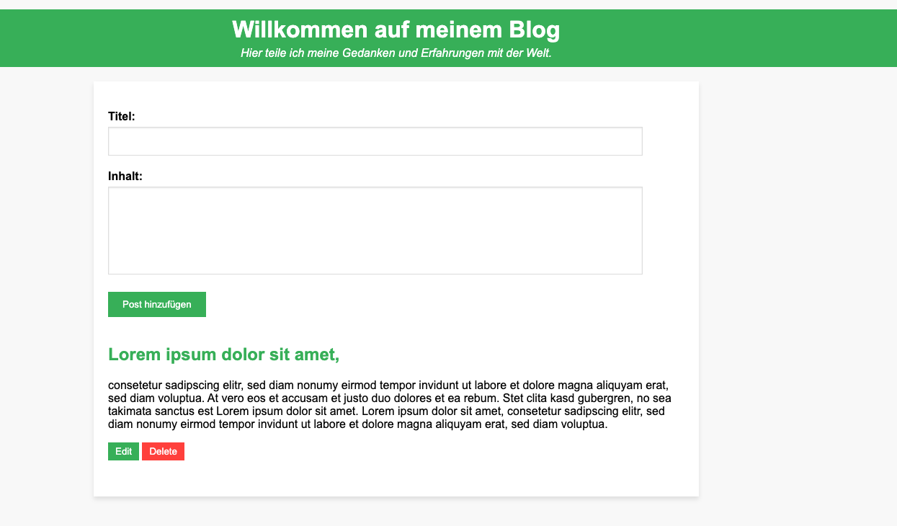

# Simple Blog App

Diese Blog-App ist ein einfaches, serverseitiges JavaScript-Projekt, das mit Express.js erstellt wurde. Es ermöglicht Benutzern das Anzeigen, Hinzufügen, Bearbeiten und Löschen von Blog-Posts in einer PostgreSQL-Datenbank.

## Funktionen

- Anzeigen aller Blog-Posts auf der Startseite.
- Hinzufügen neuer Blog-Posts über ein einfaches Formular.
- Bearbeiten bestehender Blog-Posts.
- Löschen von Blog-Posts.

## Voraussetzungen

### Bevor Sie die App starten, stellen Sie sicher, dass Sie die folgenden Voraussetzungen erfüllt haben:

- Node.js installiert
- PostgreSQL-Datenbank läuft
- Eine `.env`-Datei mit den erforderlichen Datenbankanmeldeinformationen

## Installation

### Um das Projekt zu installieren, klonen Sie das Repository und installieren Sie die Abhängigkeiten:

git clone (https://github.com/mustafaemrekuecuek/Blog-App.git)
npm install

## Konfiguration
### Stellen Sie sicher, dass Sie die .env-Datei im Wurzelverzeichnis des Projekts erstellt haben und die folgenden Variablen gesetzt sind:

DB_USER=IhrDBBenutzername
DB_PASSWORD=IhrDBPasswort
DB_HOST=localhost
DB_PORT=5432
DB_DATABASE=IhrDBName

Ersetzen Sie die Platzhalter mit Ihren tatsächlichen Datenbankinformationen.

## Datenbank Einrichtung
### Führen Sie die folgenden SQL-Befehle aus, um die erforderliche Posts-Tabelle zu erstellen:

CREATE TABLE Posts (
    id SERIAL PRIMARY KEY,
    title VARCHAR(255),
    content TEXT
);

## Starten der App
### Nachdem Sie die Konfiguration abgeschlossen haben, starten Sie den Server mit:

node app.js
node database.js
Die App wird auf http://localhost:3000 verfügbar sein.

## Lizenz

Dieses Projekt ist unter der MIT Lizenz lizenziert - siehe die [LICENSE.md](LICENSE) Datei für Details.
